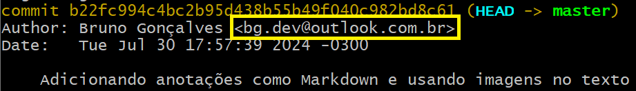
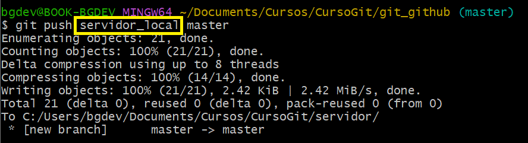

## O que é o git?
É um sistema controle de versão
É um servidor para guardar seus códigos, é um repositório de códigos

## Para que serve o git?
- Manter histórico de alteração
- Ter controle sobre cada alteração no código
- Para que uma alteração feita por uma pessoa não prejudique a modificação que outra pessoa fez, por exemplo upar um arquivo sobre o arquivo que seu colega upou com as modificações dele, o sistema informa que existem alterações a serem baixadas!

- Serve para guardar com segurança, compartilhar com outros colaboradores, e gerenciar as diferenças versões do mesmo código.

- O git serve para trabalhar de forma mais organizada em equipe, as alterações nos arquivos são mantidos em um servidor específico para isso
- Salvar o histótico de modificações dos arquivos e ter acesso a eles posteriormente!

### COMANDO: git init
- Serve para o git passar a enxergar determinado diretório como um repositório e obeservar as mudanças nos arquivos
- Cria um repositório GIT dentro de um diretório, onde fica registrado os dados daquele arquivo, por exemplo o histórico de alterações dele.

### COMANDO: git add
> Adiciona arquivos aptos para fazer commits
- Passa a monitorar as mudanças nos arquivos
Pode ser usado de duas formas:
Um arquivo por vez: "git add nome_do_arquivo.extensão"
Todos os arquivos do diretótio: "git add ."

### Aprendizados
>- O que são (e para que servem) sistemas de controle de versões e como eles podem ajudar o nosso fluxo de desenvolvimento.
>>- Manter um histórico de alterações;
>>- Ter controle sobre cada alteração no código;
>>- Nos ajudam para que uma alteração de determinada pessoa não influencie na alteração realizada por outra e etc.
>- O que é o Git e como instalá-lo;
>- Criar um repositório Git com o comando git init;
>- Como analisar o estado do nosso repositório através do comando git status.

## O que é um commit?
> Commit é salvar um estado ou uma versão do código, de maneira a criar um histórico de alterações e um ponto de retorno caso necessário, como um checkpoint.

### COMANDO: git commit -m
> Realiza o commit
- Você está salvando o progresso do desenvolvimento, marcando um checkpoint no seu código, possibilitando que você retorne aquele ponto específico.
- "-m" Possibilita você passar uma mensagem deescritiva daquele commmit explicando o que foi modificado!

### Configuração de AUTOR:
Ver o nome do autor:
- git config user.name

Ver o email do autor:
- git config user.email

Mudar o nome e email do Autor localmente e globalmente:
- git config --local (Para o projeto em específico)
- git config --global (Máquina como um todo)

## Mostrar o histórico de commit

- git log

### Informações deste comando
- Identidade única: hash
- Bransh: Local onde está -> ???
- Autor
- Email do autor
- Data
- Descrição

#### **HASH - Identidade única de um commit**

>Usado para fazer coisas(???) vou aprender mais pra frente!

#### **BRANSH - Não sei o que é (Aprender)**

>Não sei para o que é usado (Aprender)
O que sei é que a primeira palavra por exemplo 'HEAD' -> está relacionado a localidade do código, mas ficou meio breve está informação!

#### **AUTHOR NAME - Nome do autor do commit**

#### **AUTHOR EMAIL - Email do autor do commit**

#### **DATE - Data commit**

#### **DESCRIPTION - Descrição**

>**Boa prática** explicar em breves palavras o que aquele commit é responsável de forma clara, para que qualquer leitor entenda do que se refere!

## Outros formatos de visualização de logs

### COMANDO: 'git log --oneline' (Muito utilizado)

>Mostra os commit em apenas uma linha, informando o começo do 'hash' e a 'descrição' apenas.

### COMANDO: 'git log -p'

>Mostra os commit de maneira mais detalhada, informando o que foi alterado.

### COMANDO: 'git log --help'
>Abre uma documentação de ajuda

### Outros comandos
>Acesse o link e veja alguns comandos interessantes:   
>site: https://devhints.io/git-log   
>pdf: [Git Log Cheatsheet](doc/git_log_cheatsheet.pdf)

## Não monitorar determinados arquivos ou pastas
>Nem sempre você vai querer monitorar todos os arquivos e pastas de um diretório, para isto existe uma maneira de fazer o GIT ignorar eles!

>Nesta image, se a pasta 'img' e os arquivos 'anotacoes.md' e 'index.html' eu quero monitorar apenas o arquivo html, para isto eu crio um arquivo chamado '.gitignore' e dentro dele, eu escrevo o nome do que eu quero que o git ignore!

### Ignorar pastas
>Para ignorar pastas você coloca o nome da pasta e uma barra na frente como na imagem: 'img/'

### Ignorar arquivos
>Para ignorar arquivos você coloca apenas o nome do arquivo como na imagem: 'anotacoes.md'

## Como aplicar?

>Para que funcione, você faz agora o commit do arquivo '.gitignore' como nas imagens a seguir:

## Quando fazer um commit?
>É um assunto que é discútivel! Mas um consenso é que
>### nunca se deve fazer um commit em códigos não funcionais!

### Recomendações:
>- Final do dia;
>- Pequenas alterações;
>- **Novas funcionalidades**;
>- **Bugs corrigidos**.

### Aprendizados
>- Que um commit é a forma de salvar um estado ou versão do nosso código;
>- Como adicionar arquivos para serem commitados com git add;
>- Como commitar arquivos, utilizando o comando git commit;
>- Como verificar o histórico de commits, através do git log e algumas de suas opções:
>>- git log --oneline;
>>- git log -p;
>>- git log --pretty="parametros de formatação".
>- Como fazer o Git não monitorar arquivos, através do .gitignore;
>- Que não devemos realizar commit, ou seja, salvar um estado, da nossa aplicação não funcionando.

## REPOSITÓRIO REMOTO: Servidor de modificações
>Serve para que  você possa salvar, acessar suas alterações e compartilhar com outras pessoas. Pelo jeito a estrutura de pastas são importantes, ou não, porque você pode colocar em qualquer outro lugar o servidor, se você for fazer um servidor local, para aprendizado assim como eu, seguindo o curso, é melhor fazer uma pasta fora da pasta que está os arquivos do projeto.
Tenho a pasta CURSOGIT/ onde estava todos os arquivos, eu criei uma nova pasta, git_github/ movi todos os arquivos para ela, e criei em CURSOGIT/ uma nova pasta chamada servidor/. Veja como ficou na imagem a seguir:

> No Git:

## Criando um servidor local

> Dentro da pasta servidor, use o comando 'git init --bare'

### COMANDO: git init --bare
> Este servidor será apenas para controlar alterações, para isto é usado o parâmetro '--bare', neste repositório não vai ser possível editar arquivos, serve apenas para armazenar alterações.

> Você copia o caminho do seu repositório que esta sendo utilizado como servidor

>- Vá até o seu repositório onde está os arquivos do projeto
>- Adicione um repositório remoto

## COMANDO: git remote add 'nome' 'endereço'

>Nome do meu servidor é 'servidor_local'

>O endereço do meu servidor é 'C:/Users/bgdev/Documents/Cursos/CursoGit/servidor/'   

> Mas poderia ser qualquer outro, por exemplo:
>- Endereço IP de outro computador na rede;
>- Outra pasta da máquina local;
>- URL de outro servidor;
>- **Qualquer endereço válido para um repositório Git**.

## COMANDO: git remote
> Lista os repositórios remotos que o repositório local conhece.

## COMANDO: git remote -v
> Lista o endereço do repositório remoto.

>Informa também onde vai **BUSCAR** dados:

>E **ENVIAR** dados:

>Existe a possibilidade de **BUSCAR** de um endereço e **ENVIAR** para outro. Usadas em infraestruturas mais robustas e complexas.

## COMANDO: git clone
### Compartilhando / Trabalho em equipe
> Simulando que tenhamos que trabalhar em equipe, e compartilhar nosso projeto, criamos uma pasta dentro de CURSOGIT/, chamada user2/

>E então para que o user2 tenha o projeto para trabalhar, precisamos **CLONAR** os dados do **repositório servidor**

> Assim, vai criar dentro da pasta user2/ uma pasta chamada servidor, para renomear, é necessário apenas colocar o nome desejado na frente do endereço.

>Comando:

>Endereço:

>Nome da pasta em nosso repositório:

> O repositório foi clonado, mas retornou um **WARNING**, notificando que foi clonado um repositório **vazio**!

> Isso aconteceu porque adicionamos esse repositório servidor no git_github/ mas não enviamos os dados para ele!

## Enviar os dados para o Servidor

### COMANDO: git push

>Apenas o comando git push, não é suficente para enviar os dados, pois ainda faltam algumas informações como:
>- Para onde? Qual é o **DESTINO**?
>- De onde? Qual é a **ORIGEM**?

>#### DESTINO:
>

>#### ORIGEM:
>

>Com este comando enviamos todos os DADOS, CÓDIGOS E TODAS ALTERAÇÕES que fizemos até o momento para o servidor!

## Trazer os dados para o novo USUÁRIO

Quando clonamos o repositório para o user2/ renomeamos a pasta, para projeto, mas o servidor não, ele fica com outro nome:

### Renomear um ?servidor? Não sei se seria bem renomear o servidor, mas ta renomeando alguma coisa!

>**É importante os servidores terem o mesmo nome**
### COMANDO: git remote 'nome_alterar' 'nome_novo'

### COMANDO: git pull
>Este comando pega os dados de um repositório **REMOTO** e trás para o **LOCAL**

>#### Resultado:
>
>O resultado não foi como esperado seguindo a trilha do curso, pois coloquei para monitorar a pasta como um todo, e acabou que eu mandei não os arquivos da pasta git_github/ mas sim os arquivos da pasta CURSOGIT/!

> O que importa é que o arquivo index foi **compartilhado**!
>

## **PUSH = EMPURRAR** = ENVIAR AS MODIFICAÇÕES

## **PULL = PUXA** = BAIXAR AS MODIFICAÇÕES

### Fazendo PUSH para o GitHub com HTTPS

> Copia o endereço do repositório no GitHub

>**Logado** ou seja na pasta onde se encontra os dados que você quer subir para o GitHub:

Utilize o seguinte comando com endereço copiado **https**:

O repositório remoto **ORIGIN** segundo o professor no qual estou acompanhando disse que é uma convesão padrão utilizar esse nome, mas nada impede de você mudar!

### COMANDO: git push -u origin master
> Padroniza o push sempre para este repositório e esta bransh! Mas nada impede de também não utilizar o -u e você por conta própria direcionar! 
O professor disse que prefere não utilizar e ele mesmo direcionar, por questão de controle e certeza de direcionamento.

Neste momento será solicitado a sua senha, no windows abrirá uma janela, no linux, será solicitado no terminal de comando mesmo.

Pronto, seus arquivos foram enviados ao GitHub, não apenas os arquivos mas também os histórico de commit e modificações.

### Aprendizados
>- O que são repositórios remotos;
>- Como criar um repositório Git sem uma cópia dos arquivos (com --bare ) para ser utilizado como servidor;
>- Como adicionar links para os repositórios remotos, com o comando git remote add ;
>- Como baixar um repositório pela primeira vez, clonando-o com o comando git clone ;
>- Como trazer e enviar as nossas alterações para um repositório remoto, com git push ;
>- Como atualizar o nosso repositório com os dados no repositório remoto, utilizando git pull ;
>- O que é e para que serve o GitHub;
>- Como criar um repositório no GitHub;
>- Como adicionar um repositório do GitHub como repositório remoto.

## O que é bransh?
É um conteúdo um pouco díficil de entender no começo, mas se trata de uma linha de desenvolvimento ou linha do tempo de um projeto, pode haver uma ou mais, que normalmente é:
>- **Master** o que está em produção
>- **Main**
>- **Podem exister outras**, com conteúdos especificos para cada funcionalidade.

O correto é para cada funcionalidade, criar uma nova branch, desta forma cada trabalho é separado em uma linha de desenvolvimento/produção/tempo único, e tudo é agrupado, quando é colocado na branch '**Master**', ou seja quando estiver pronto. Existem padrões de mercados para criar os nomes e cada empresa podem também possuir um padrão interno, geralmente segue desta forma:
>- 'feature/nome_descritivo_da_funcionalidade' por exemplo: 'feature/titulo'

### COMANDO: git branch
Lista de branch no determinado diretório.

Conforme na imagem, pode se ver grifado de verde, é onde você estará trabalhando no momento.

### Como criar um novo branch? COMANDO: git branch new_branch

Utilizando novamente o comando git branch, você conseguirá notar a diferença entre as cores, mostrando em qual branch está localizado.

### Como mudar de branch? COMANDO: git checkout nome_branch
Desta forma é possível mudar a branch a ser trabalhada.

## Ferramenta Vizualizing git
Utilize essa ferramenta para poder enxergar de maneira visual, o comportamento do git.

https://git-school.github.io/visualizing-git/

Assim que entra por padrão já estamos na branch **Master**

## Na prática: Criando uma nova branch:
Criando um commit em branch **Master**:

Indo para branch **titulo** e criando um commit:

Veja que foi criada uma nova linha de desenvolvimento, ou seja, a branch t**itulo** não tem acesso ao commit que foi feito anteriormente na branch **master**, para ter acesso a ela, teria que ter feito o commit antes de criar a branch nova.

Agora, o primeiro commit que foi feito, o **titulo** tem acesso a esse conteudo, e a **master** continua o trabalho no qual não se relaciona com o **titulo**.

Desta forma, temos:

>- Branch **titulo**, com dois commits independentes;
>- Branch **master**, possui um novo commit;
>- Branch **lista**, surge na terceira commit da **master**, e gera 2 commits independentes.

Alimentei mais alguns commit em cada uma das branch, e agora temos:
>- Branch **titulo**, com três commits independentes;
>- Branch **master**, possui três commits independentes;
>- Branch **lista**, possui dois commits independentes;

 ### COMANDO: git checkout -b new_branch || Comando para criar uma nova branch e entrar nela logo em seguida, um 'ATALHO'.
Utilizando outro usuário no caso, simulado por uma outra pasta chamada '**user2**', utilzo o comando, para criar e entrar na nova branch **lista**.

