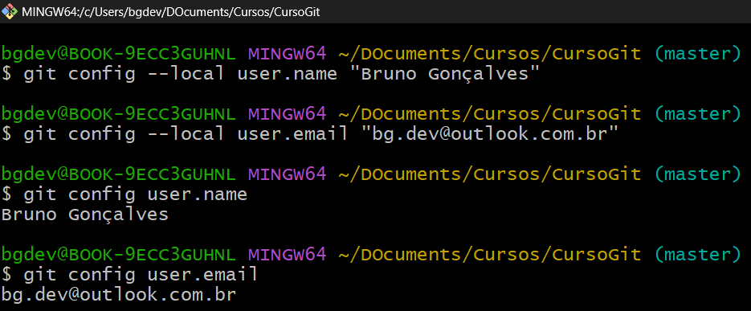
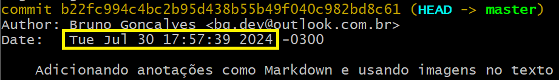

## O que é o git?
É um sistema controle de versão
É um servidor para guardar seus códigos, é um repositório de códigos

## Para que serve o git?
- Manter histórico de alteração
- Ter controle sobre cada alteração no código
- Para que uma alteração feita por uma pessoa não prejudique a modificação que outra pessoa fez, por exemplo upar um arquivo sobre o arquivo que seu colega upou com as modificações dele, o sistema informa que existem alterações a serem baixadas!

- Serve para guardar com segurança, compartilhar com outros colaboradores, e gerenciar as diferenças versões do mesmo código.

- O git serve para trabalhar de forma mais organizada em equipe, as alterações nos arquivos são mantidos em um servidor específico para isso
- Salvar o histótico de modificações dos arquivos e ter acesso a eles posteriormente!

### COMANDO: git init
- Serve para o git passar a enxergar determinado diretório como um repositório e obeservar as mudanças nos arquivos
- Cria um repositório GIT dentro de um diretório, onde fica registrado os dados daquele arquivo, por exemplo o histórico de alterações dele.

### COMANDO: git add
> Adiciona arquivos aptos para fazer commits
- Passa a monitorar as mudanças nos arquivos
Pode ser usado de duas formas:
Um arquivo por vez: "git add nome_do_arquivo.extensão"
Todos os arquivos do diretótio: "git add ."

## O que é um commit?
> Commit é salvar um estado ou uma versão do código, de maneira a criar um histórico de alterações e um ponto de retorno caso necessário, como um checkpoint.

### COMANDO: git commit -m
> Realiza o commit
- Você está salvando o progresso do desenvolvimento, marcando um checkpoint no seu código, possibilitando que você retorne aquele ponto específico.
- "-m" Possibilita você passar uma mensagem deescritiva daquele commmit explicando o que foi modificado!

### Configuração de AUTOR:
Ver o nome do autor:
- git config user.name

Ver o email do autor:
- git config user.email

Mudar o nome e email do Autor localmente e globalmente:
- git config --local (Para o projeto em específico)
- git config --global (Máquina como um todo)

## Mostrar o histórico de commit

- git log

### Informações deste comando
- Identidade única: hash
- Bransh: Local onde está -> ???
- Autor
- Email do autor
- Data
- Descrição

#### **HASH - Identidade única de um commit**

>Usado para fazer coisas(???) vou aprender mais pra frente!

#### **BRANSH - Não sei o que é (Aprender)**

>Não sei para o que é usado (Aprender)
O que sei é que a primeira palavra por exemplo 'HEAD' -> está relacionado a localidade do código, mas ficou meio breve está informação!

#### **AUTHOR NAME - Nome do autor do commit**

#### **AUTHOR EMAIL - Email do autor do commit**

#### **DATE - Data commit**

#### **DESCRIPTION - Descrição**

>**Boa prática** explicar em breves palavras o que aquele commit é responsável de forma clara, para que qualquer leitor entenda do que se refere!

## Outros formatos de visualização de logs

### COMANDO: 'git log --oneline' (Muito utilizado)

>Mostra os commit em apenas uma linha, informando o começo do 'hash' e a 'descrição' apenas.

### COMANDO: 'git log -p'

>Mostra os commit de maneira mais detalhada, informando o que foi alterado.

### COMANDO: 'git log --help'
>Abre uma documentação de ajuda

### Outros comandos
>Acesse o link e veja alguns comandos interessantes:   
>site: https://devhints.io/git-log   
>pdf: [Git Log Cheatsheet](doc/git_log_cheatsheet.pdf)

## Não monitorar determinados arquivos ou pastas
>Nem sempre você vai querer monitorar todos os arquivos e pastas de um diretório, para isto existe uma maneira de fazer o GIT ignorar eles!

>Nesta image, se a pasta 'img' e os arquivos 'anotacoes.md' e 'index.html' eu quero monitorar apenas o arquivo html, para isto eu crio um arquivo chamado '.gitignore' e dentro dele, eu escrevo o nome do que eu quero que o git ignore!

### Ignorar pastas
>Para ignorar pastas você coloca o nome da pasta e uma barra na frente como na imagem: 'img/'

### Ignorar arquivos
>Para ignorar arquivos você coloca apenas o nome do arquivo como na imagem: 'anotacoes.md'

## Como aplicar?

>Para que funcione, você faz agora o commit do arquivo '.gitignore' como nas imagens a seguir:

## Quando fazer um commit?
>É um assunto que é discútivel! Mas um consenso é que
>### nunca se deve fazer um commit em códigos não funcionais!

### Recomendações:
>- Final do dia;
>- Pequenas alterações;
>- **Novas funcionalidades**;
>- **Bugs corrigidos**.

## REPOSITÓRIO REMOTO: Servidor de modificações
>Serve para que  você possa salvar, acessar suas alterações e compartilhar com outras pessoas. Pelo jeito a estrutura de pastas são importantes, ou não, porque você pode colocar em qualquer outro lugar o servidor, se você for fazer um servidor local, para aprendizado assim como eu, seguindo o curso, é melhor fazer uma pasta fora da pasta que está os arquivos do projeto.
Tenho a pasta CURSOGIT/ onde estava todos os arquivos, eu criei uma nova pasta, git_github/ movi todos os arquivos para ela, e criei em CURSOGIT/ uma nova pasta chamada servidor/. Veja como ficou na imagem a seguir:

> No Git:

## Criando um servidor local

> Dentro da pasta servidor, use o comando 'git init --bare'

### COMANDO: git init --bare
> Este servidor será apenas para controlar alterações, para isto é usado o parâmetro '--bare', neste repositório não vai ser possível editar arquivos, serve apenas para armazenar alterações.

> Você copia o caminho do seu repositório que esta sendo utilizado como servidor

>- Vá até o seu repositório onde está os arquivos do projeto
>- Adicione um repositório remoto

## COMANDO: git remote add 'nome' 'endereço'

>Nome do meu servidor é 'servidor_local'

>O endereço do meu servidor é 'C:/Users/bgdev/Documents/Cursos/CursoGit/servidor/'   

> Mas poderia ser qualquer outro, por exemplo:
>- Endereço IP de outro computador na rede;
>- Outra pasta da máquina local;
>- URL de outro servidor;
>- **Qualquer endereço válido para um repositório Git**.

## COMANDO: git remote
> Lista os repositórios remotos que o repositório local conhece.

## COMANDO: git remote -v
> Lista o endereço do repositório remoto.

>Informa também onde vai **BUSCAR** dados:

>E **ENVIAR** dados:

>Existe a possibilidade de **BUSCAR** de um endereço e **ENVIAR** para outro. Usadas em infraestruturas mais robustas e complexas.

## COMANDO: git clone
### Compartilhando / Trabalho em equipe
> Simulando que tenhamos que trabalhar em equipe, e compartilhar nosso projeto, criamos uma pasta dentro de CURSOGIT/, chamada user2/

>E então para que o user2 tenha o projeto para trabalhar, precisamos **CLONAR** os dados do **repositório servidor**

> Assim, vai criar dentro da pasta user2/ uma pasta chamada servidor, para renomear, é necessário apenas colocar o nome desejado na frente do endereço.

>Comando:

>Endereço:

>Nome da pasta em nosso repositório:

> O repositório foi clonado, mas retornou um **WARNING**, notificando que foi clonado um repositório **vazio**!

> Isso aconteceu porque adicionamos esse repositório servidor no git_github/ mas não enviamos os dados para ele!

## Enviar os dados para o Servidor

### COMANDO: git push

>Apenas o comando git push, não é suficente para enviar os dados, pois ainda faltam algumas informações como:
>- Para onde? Qual é o **DESTINO**?
>- De onde? Qual é a **ORIGEM**?

>#### DESTINO:
>

>#### ORIGEM:
>

>Com este comando enviamos todos os DADOS, CÓDIGOS E TODAS ALTERAÇÕES que fizemos até o momento para o servidor!

## Trazer os dados para o novo USUÁRIO

Quando clonamos o repositório para o user2/ renomeamos a pasta, para projeto, mas o servidor não, ele fica com outro nome:

### Renomear um ?servidor? Não sei se seria bem renomear o servidor, mas ta renomeando alguma coisa!

>**É importante os servidores terem o mesmo nome**
### COMANDO: git remote 'nome_alterar' 'nome_novo'

### COMANDO: git pull
>Este comando pega os dados de um repositório **REMOTO** e trás para o **LOCAL**

>#### Resultado:
>
>O resultado não foi como esperado seguindo a trilha do curso, pois coloquei para monitorar a pasta como um todo, e acabou que eu mandei não os arquivos da pasta git_github/ mas sim os arquivos da pasta CURSOGIT/!

> O que importa é que o arquivo index foi **compartilhado**!
>

## **PUSH = EMPURRAR** = ENVIAR AS MODIFICAÇÕES

## **PULL = PUXA** = BAIXAR AS MODIFICAÇÕES     